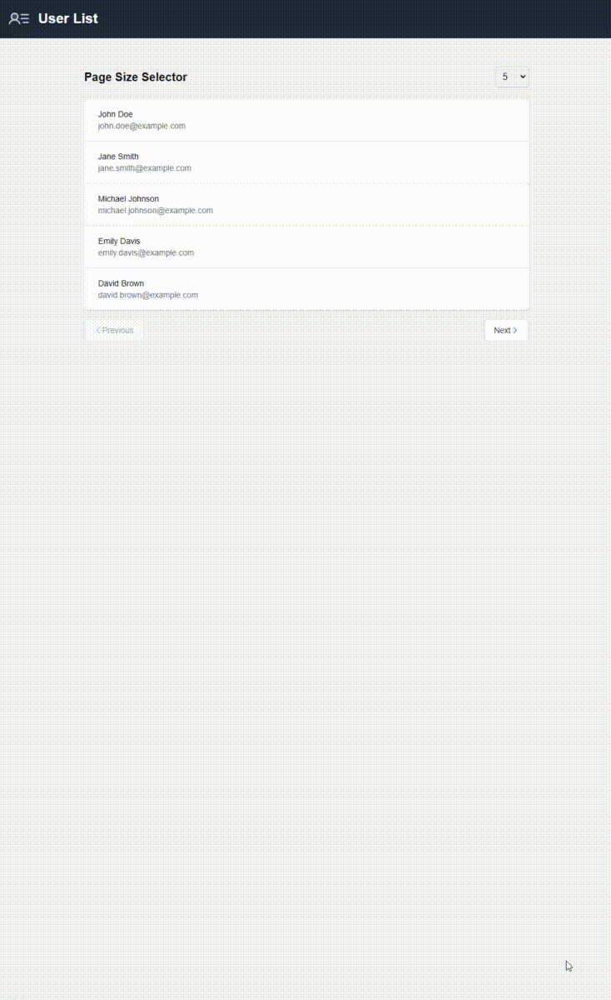

# 📚 Client-Side Paginator with TypeScript Generics 🚀

Welcome to the Client-Side Paginator project! This application demonstrates an efficient client-side pagination solution built using **Next.js 15** and **TypeScript**. The project utilizes server actions to simulate backend database calls, implementing effective caching strategies and abstracting pagination logic into a reusable TypeScript class. ✨

## 🎯 Features

- **Client-Side Pagination**: Load and display data in manageable chunks.
- **TypeScript Generics**: Enhance reusability and type safety.
- **Client-Side Caching**: Speed up data access using caching mechanisms.
- **Separation of Concerns**: Clean and organized code structure for better maintainability.

## 👁️🖥️ How it looks?




## 🛠️ Getting Started

Follow these steps to set up and run the project locally! 🔧

### Prerequisites

Ensure you have the following installed:

- [Node.js](https://nodejs.org/) (v14 or higher)
- [npm](https://www.npmjs.com/get-npm) or [yarn](https://yarnpkg.com/getting-started/install)

### Clone the Repository

Start by cloning this repository to your local machine:

```bash
git clone https://github.com/oxyprogrammer/efficient-paginator.git
cd efficient-paginator
```

### Install Dependencies
Next, install the project dependencies:
```bash
npm install
# or
yarn install
```

### Run the Development Server
Now, you can run the development server:

``` bash
Copy
npm run dev
# or
yarn dev
```

Open your browser and visit http://localhost:3000 to see the application in action! 🎉

## 📖 Usage
To use the paginator in your components, import the paginator class you created and initialize it with your data. You can customize the items per page and handle the current page state as necessary. Check out the example in the src/components/Paginator.tsx file for details!

## 🤝 Contributing
Contributions are welcome! If you'd like to contribute to this project, please fork the repository and submit a pull request.

## 📄 License
This project is licensed under the MIT License - see the LICENSE file for details.

## 🌟 Acknowledgements
Thanks for taking the time to explore this project! If you find it helpful, please consider giving it a star ⭐ on GitHub!

Happy coding! 💻✨
